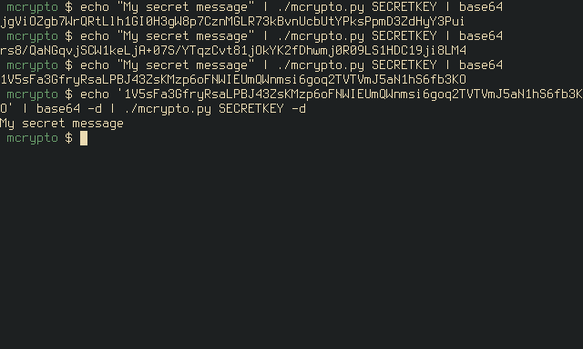

# mcrypto

Some crypto implementations for testing attacks.

This implementation is python2 only due to the way python3 handles
strings.

*** NOT SECURE, DO NOT USE FOR ANYTHING YOU CARE ABOUT ***

The current aes implementation in this library is *NOT* secure.

1. It uses (truncated or padded) raw keys instead of generating one
   using a key-derivation function. Technically not fatal but can
   easily allow in low entropy keys with incorrect use.

2. It is complete broken by side-channel attacks

As long as you understand this code is not suitable for production,
feel free to play around with it.

# Currently implmented

- AES-128-ECB
- AES-128-CBC

The implementations are technically correct but vulnerable to side
channel attacks.

# Example usage

    import aes

    plaintext = "Attack at dawn"   # any length, padding is added by default
    key = "Random password."   # 16 bytes (raw key)
    ciphertext = aes.encrypt_128_cbc(plaintext,key)

mcrypto.py is a simple example script that can encrypt and decrypt based on command line argument

